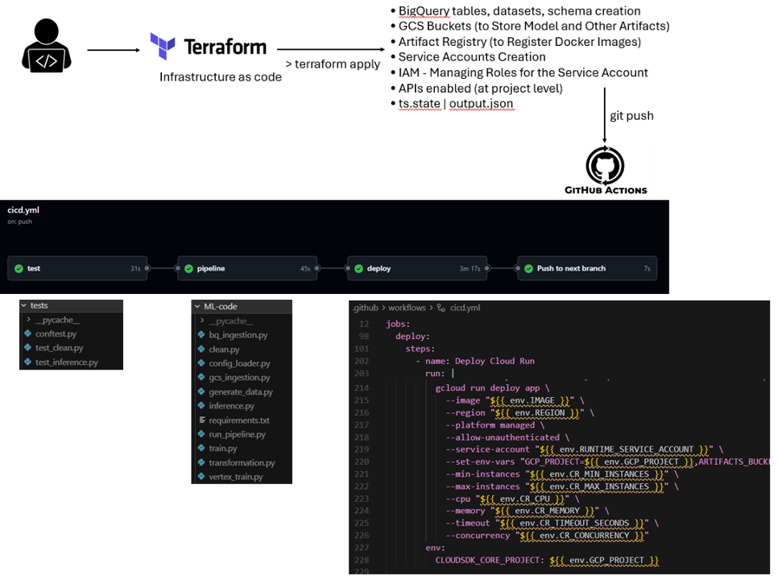

# Terraform Implementation Guide 

## Terraform + CI/CD: Infrastructure as Code for ML/AI/Data Projects

> **Document Type:** Internal Engineering Reference  
> **Audience:** Engineers new to Infrastructure as Code (beginner → intermediate)  
> **Status:** 🟡 Active Template — Under Review  
> **Last Updated:** 26-02-2026

---

## Table of Contents

1. [Introduction](01-introduction.md)
2. [Why Terraform Instead of Python + GCP SDK](02-why-terraform-python-gcp-sdk.md)
3. [Responsibility Split: Terraform vs CI/CD](03-responsibility-split-terraform-cicd.md)
4. [Terraform Project Structure](04-terraform-project-structure.md)
5. [Terraform Code Walkthrough](05-terraform-code-walkthrough.md)
6. [Terraform Workflow](06-terraform-workflow.md)
7. [CI/CD Integration](07-cicd-integration.md)
8. [Maintenance & Scaling](08-maintenance-scaling.md)
9. [Quick Reference Cheatsheet](09-quick-reference-cheatsheet.md)
10. [End-to-End Flowchart (Terraform + CI/CD)](10-terraform-cicd-flowchart.md)

---

**Part 3 · Responsibility Split: Terraform vs CI/CD** · [← Index](README.md)

---

## 3. Responsibility Split: Terraform vs CI/CD

One of the most important architectural decisions in any DataNeurus project is understanding **who owns what**. Blurring this boundary leads to confusion, duplication, and fragility.

### 3.1 The Core Principle

```
┌──────────────────────────────────────────────────────────────┐
│                                                              │
│   TERRAFORM = "Build the stage"                              │
│   CI/CD     = "Run the show"                                 │
│                                                              │
│   Terraform creates the INFRASTRUCTURE.                      │
│   CI/CD uses that infrastructure to run APPLICATIONS.        │
│                                                              │
└──────────────────────────────────────────────────────────────┘
```

### 3.2 Responsibility Comparison Table

| Concern | Owner | Why |
|---|---|---|
| GCP APIs (enablement) | **Terraform** | One-time setup, tracked in state |
| Service Accounts | **Terraform** | IAM is security-critical; must be versioned |
| IAM Roles & Bindings | **Terraform** | Security policy must be auditable |
| GCS Bucket (data) | **Terraform** | Persistent resource, needs state tracking |
| GCS Bucket (artifacts) | **Terraform** | Persistent resource, needs state tracking |
| BigQuery Dataset | **Terraform** | Persistent resource, schema-managed |
| BigQuery Table | **Terraform** | Schema lives in `config.yaml`, managed declaratively |
| Artifact Registry (Docker repo) | **Terraform** | Persistent resource |
| Generating `terraform-output.json` | **Both** | Terraform produces it; CI/CD consumes it |
| Running `pytest` | **CI/CD** | Testing is a CI/CD responsibility |
| ML Pipeline execution | **CI/CD** | Operational/application concern |
| Docker image build | **CI/CD** | App-layer concern |
| Docker image push | **CI/CD** | App-layer concern |
| Cloud Run Service | **CI/CD** | Application concern; image changes with every deploy |
| Branch promotion (dev→qa→prod) | **CI/CD** | Workflow automation |

### 3.3 The Bridge: `terraform-output.json`

The handoff between Terraform and CI/CD happens through a **committed output file**:



---

```
┌─────────────────────┐          ┌──────────────────────────┐
│     TERRAFORM       │          │         CI/CD            │
│                     │  outputs │                          │
│  - Creates bucket   │ ──────►  │  - Reads bucket name     │
│  - Creates dataset  │  .json   │  - Reads dataset ID      │
│  - Creates SA       │  file    │  - Reads SA email        │
│  - Creates repo URL │          │  - Deploys Cloud Run     │
└─────────────────────┘          └──────────────────────────┘
         │                                    │
         └────────── Only secret ─────────────┘
                    = GCP_SA_KEY
```

`terraform/terraform-output.json` is:
- Generated by `terraform output -json > terraform-output.json`
- Committed to the repo (it contains **no secrets** — only names and IDs)
- Read by CI/CD jobs to avoid duplicating config in GitHub Secrets

> ✅ **This is the only "bridge" between Terraform and CI/CD. No other values should be hardcoded in GitHub Secrets (except `GCP_SA_KEY`).**

---

[← Previous: Why Terraform Instead of Python + GCP SDK](02-why-terraform-python-gcp-sdk.md) · [Index](README.md) · [Next: Terraform Project Structure →](04-terraform-project-structure.md)
