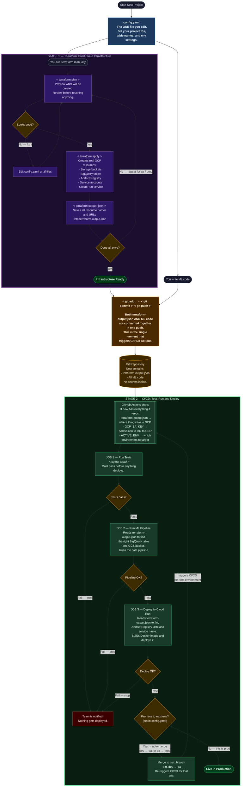

```mermaid
flowchart TD
 START([Start New Project]) --> CONFIG

 CONFIG["config.yaml
 The ONE file you edit.
 Set your project IDs,
 table names, and env settings."]

 CONFIG --> TF_BRANCH
 CONFIG --> CODE_BRANCH

 %% TERRAFORM STAGE 
 subgraph TERRAFORM_STAGE ["STAGE 1 — Terraform: Build Cloud Infrastructure"]

 TF_BRANCH([You run Terraform manually])

 TF_BRANCH --> PLAN["< terraform plan >
 Preview what will be created.
 Review before touching anything."]

 PLAN --> REVIEW{Looks good?}
 REVIEW -- "No — fix it" --> FIX[Edit config.yaml or .tf files]
 FIX --> PLAN

 REVIEW -- "Yes" --> APPLY["< terraform apply >
 Creates real GCP resources:
 - Storage buckets
 - BigQuery tables
 - Artifact Registry
 - Service accounts
 - Cloud Run service"]

 APPLY --> OUTPUT["< terraform output -json >
 Saves all resource names and URLs
 into terraform-output.json"]

 OUTPUT --> ENV_LOOP{Done all envs?}
 ENV_LOOP -- "No → repeat for qa / prod" --> PLAN
 ENV_LOOP -- "Yes" --> TF_DONE(["Infrastructure Ready"])
 end

 %% ML CODE STAGE 
 CODE_BRANCH(["You write ML code"])

 %% SINGLE GIT COMMIT & PUSH — outside both stages 
 TF_DONE --> GIT_COMMIT
 CODE_BRANCH --> GIT_COMMIT

 GIT_COMMIT["< git add .  >  < git commit >  < git push >
 
 Both terraform-output.json AND ML code
 are committed together in one push.
 This is the single moment that
 triggers GitHub Actions."]

 GIT_COMMIT --> GIT_REPO[("Git Repository
 Now contains:
 - terraform-output.json
 - All ML code
 No secrets inside.")]

 GIT_REPO --> GHA

 %% CI/CD STAGE 
 subgraph CICD_STAGE ["STAGE 2 — CI/CD: Test, Run and Deploy"]

 GHA[["GitHub Actions starts
 It now has everything it needs:
 - terraform-output.json → where things live in GCP
 - GCP_SA_KEY → permission to talk to GCP
 - ACTIVE_ENV → which environment to target"]]

 GHA --> JOB_TEST["JOB 1 — Run Tests
 < pytest tests/ >
 Must pass before anything deploys."]

 JOB_TEST --> TEST_PASS{Tests pass?}
 TEST_PASS -- "Fail — stop" --> NOTIFY["Team is notified.
 Nothing gets deployed."]
 TEST_PASS -- "Pass" --> JOB_PIPELINE

 JOB_PIPELINE["JOB 2 — Run ML Pipeline
 Reads terraform-output.json to find
 the right BigQuery table and GCS bucket.
 Runs the data pipeline."]

 JOB_PIPELINE --> PIPE_PASS{Pipeline OK?}
 PIPE_PASS -- "Fail — stop" --> NOTIFY
 PIPE_PASS -- "Pass" --> JOB_DEPLOY

 JOB_DEPLOY["JOB 3 — Deploy to Cloud Run
 Reads terraform-output.json to find
 Artifact Registry URL and service name.
 Builds Docker image and deploys it."]

 JOB_DEPLOY --> DEPLOY_PASS{Deploy OK?}
 DEPLOY_PASS -- "Fail — stop" --> NOTIFY
 DEPLOY_PASS -- "Pass" --> JOB_PROMOTE

 JOB_PROMOTE{"Promote to next env?
 (set in config.yaml)"}

 JOB_PROMOTE -- "Yes → auto-merge
 dev → qa, or qa → prod" --> MERGE["Merge to next branch
 e.g. dev → qa
 Re-triggers CI/CD for that env."]

 JOB_PROMOTE -- "No — this is prod" --> PROD_DONE(["Live in Production"])
 end

 MERGE -- "triggers CI/CD
 for next environment" --> GHA

 %% STYLES 
 classDef config fill:#1e3a5f,stroke:#4a9eff,color:#e8f4ff,font-weight:bold
 classDef terraform fill:#2d1b69,stroke:#9b59b6,color:#f0e6ff
 classDef gitcommit fill:#4a2800,stroke:#ff9900,color:#fff0d0,font-weight:bold
 classDef gitrepo fill:#3d2800,stroke:#ff9900,color:#fff0d0
 classDef cicd fill:#1a3a2a,stroke:#2ecc71,color:#e6fff0
 classDef decision fill:#3d2b00,stroke:#f39c12,color:#fff8e6
 classDef danger fill:#3d0000,stroke:#e74c3c,color:#ffe6e6
 classDef success fill:#003d1a,stroke:#27ae60,color:#e6fff0,font-weight:bold
 classDef neutral fill:#1a1a2e,stroke:#6c7a89,color:#dce3ea

 style TERRAFORM_STAGE fill:#1a0f2e,stroke:#9b59b6,stroke-width:3px,color:#d8c8ff
 style CICD_STAGE fill:#0a1f12,stroke:#2ecc71,stroke-width:3px,color:#c8ffd8

 class CONFIG config
 class PLAN,APPLY,OUTPUT,FIX terraform
 class GIT_COMMIT gitcommit
 class GIT_REPO gitrepo
 class GHA,JOB_TEST,JOB_PIPELINE,JOB_DEPLOY,MERGE cicd
 class REVIEW,ENV_LOOP,TEST_PASS,PIPE_PASS,DEPLOY_PASS,JOB_PROMOTE decision
 class NOTIFY danger
 class TF_DONE,PROD_DONE success
 class START,TF_BRANCH,CODE_BRANCH neutral
```
